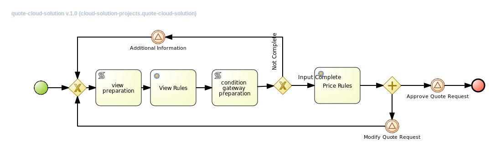

Repository Init Content
=======================

The purpose of this project is to provide a proof of concept in relation to an screen flow handled by a set of rules in the following way:
1. In an external system the end user enters project information and clicks Next.
2. The Next button submits a new Process instance for the project using cloud_solution_projects.quote_cloud_solution from cloud_solution_projects kjar.
3. The cloud_solution_projects.quote_cloud_solution process evaluates the received information with a set of rules and responds to the client application with the following results:
..1. The view-name that should be displayed next.
..2. An string representing recommendations based on the previous entered information.
4. The client application presents to the user the next screen based on the received view name from step 3 and the user enters the next collection of information.
5. The user submits the form again causing the process to evaluate the rules until all the required information for the project description is received.
6. Once the quote information is completed, the process engine will evaluate the received information through a second set of rules, giving a price and a summary screen for the user to approve the quote or make any modifications to it.
7. If the user approves the quote the quote process ends.

